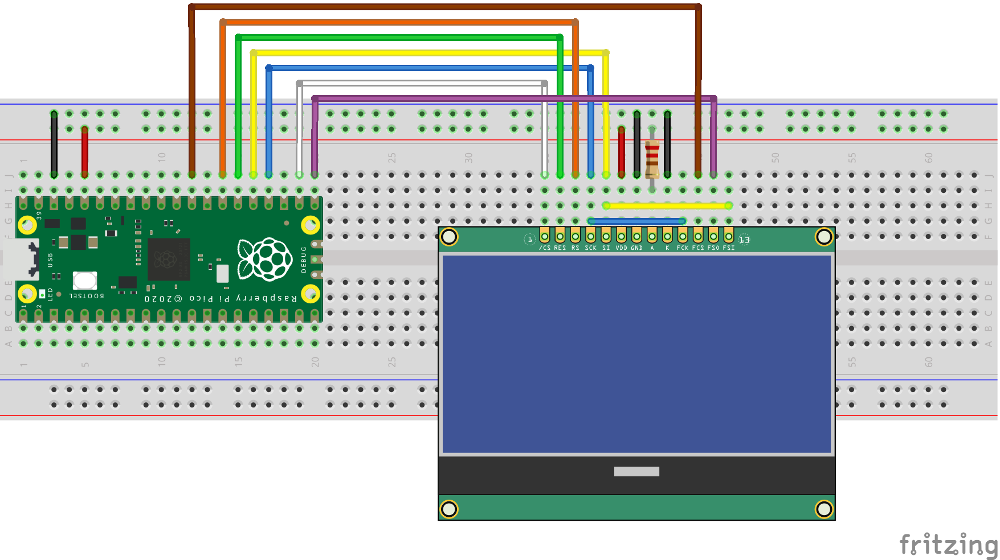

# LCD12864
Experiments with the LCD12864-06D monochrome graphic LCD.

This repository will include examples of using this display with various microcontrollers.

## Raspberry Pi Pico /RP2040

Under PiPico you will find examples tested on the Raspberry Pi Pico, it should be easy to adapt it to other boards using the RP2040 and supporting the same programming environment.

The connections between the Pi Pico and the display are as follows:

### Basic Test

Tests LCD controller initialization and simple (8x8) character display (the font is embedded in the program), using the [Pico board support by Earle F. Phillhoower III](https://github.com/earlephilhower/arduino-pico) (not the official Arduino support).

### Font Dump

A simple font ROM access test, using the [Pico board support by Earle F. Phillhoower III](https://github.com/earlephilhower/arduino-pico) (not the official Arduino support).

### UseRomFont

A remix of the two previous tests, this program writes text using the ASCII 7x8 font in the Rom.  Uses the [Pico board support by Earle F. Phillhoower III](https://github.com/earlephilhower/arduino-pico) (not the official Arduino support).

## Datasheets
Files in this directory come from the internet, I claim no copyright for them.

* LCD_Specs.png: display board dimensions and pinout, from sellers page.
* ER3805-1.pdf: datasheet for the memory chip with fonts (marked as 16S1Y).
* st7565r.pdf: datasheet for the display controller.

## Fritzing

My Fritzing component for the LCD.
